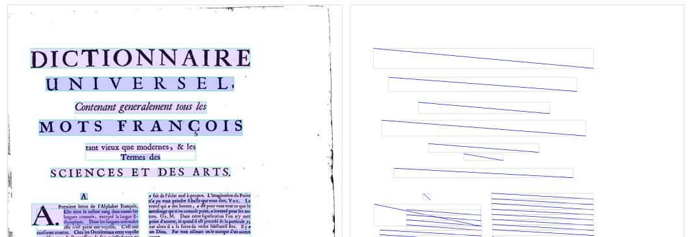
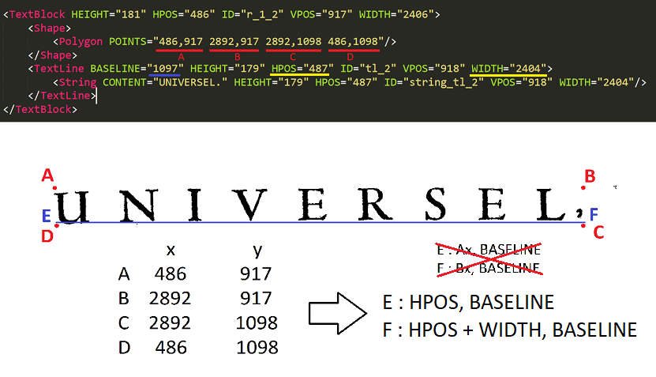

# Aspyre GT

A pipeline to transfer ground truth from [Transkribus](https://transkribus.eu/Transkribus/) to [eScriptorium](https://escriptorium.fr/).


1. [What is the problem?](https://gitlab.inria.fr/dh-projects/aspyre-gt/-/tree/master#what-is-the-problem)
2. [What is the solution?](https://gitlab.inria.fr/dh-projects/aspyre-gt/-/tree/master#what-is-the-solution)
3. [Known import errors](https://gitlab.inria.fr/dh-projects/aspyre-gt/-/tree/master#known-import-errors)

---

## What is the problem?

**`eScriptorium`** allows users to import a document's segmentation and transcription using XML ALTO as a pivot format. 

The [`imports specifications`](https://gitlab.inria.fr/scripta/escriptorium/-/blob/master/app/apps/imports/README.md) describe the expected format as follows:

> Upload a valid [ALTO XML](https://en.wikipedia.org/wiki/ALTO_(XML)) file for segmentation and transcriptions.
The file is strictly validated against ALTO v4 (http://www.loc.gov/standards/alto/ns-v4#), if it's not valid an error message will (perhaps) help you fix the issue.
Each `<Page>` in the file will correspond to a selected card in the same order.
The 'name' field is the name of the transcription in which the text content will be stored (you can select it above the transcription panel). It is possible to import content from different files in the same transcription this way.
By defaults the segmentation for the selected images, both regions and lines, will be deleted. You can disable this behavior by unchecking 'Override existing segmentation.', in which case the system will try to match the lines and regions by their `ID` attribute. The old content for matching lines is then stored in its history and new lines/regions are created when no matching existing element are found.
> 
> Here is the most basic example, 2 pages with 2 lines each.
Other tags (description, glyphs) are ignored for now.
> ```xml
> <?xml version="1.0" encoding="UTF-8"?>
> <alto xmlns:xsi="http://www.w3.org/2001/XMLSchema-instance"
> 	  xmlns="http://www.loc.gov/standards/alto/ns-v4#"
> 	  xsi:schemaLocation="http://www.loc.gov/standards/alto/ns-v4# http://www.loc.gov/standards/alto/v4/alto-4-0.xsd">
>  <Layout>
>     <Page WIDTH="850" HEIGHT="1083" PHYSICAL_IMG_NR="0" ID="page_0">
>       <PrintSpace HPOS="0" VPOS="0" WIDTH="850" HEIGHT="1083">
> 	<TextBlock HPOS="0" VPOS="0" ID="textblock_0" WIDTH="850" HEIGHT="1083">
> 	  <TextLine ID="line_0" HPOS="160" VPOS="771" WIDTH="0" HEIGHT="28">
> 	    <String ID="segment_0" CONTENT="This is an example" HPOS="160" VPOS="771" WIDTH="0" HEIGHT="28" WC="0.9995"></String>
>           </TextLine>
>         </TextBlock>
>       </PrintSpace>
>     </Page>
>     <Page WIDTH="850" HEIGHT="1083" PHYSICAL_IMG_NR="0" ID="page_1">
>       <PrintSpace HPOS="0" VPOS="0" WIDTH="850" HEIGHT="1083">
> 	<TextBlock HPOS="0" VPOS="0" ID="textblock_1" WIDTH="850" HEIGHT="1083">
> 	  <TextLine ID="line_1" HPOS="160" VPOS="771" WIDTH="0" HEIGHT="28">
> 	    <String ID="segment_1" CONTENT="This is also an example" HPOS="160" VPOS="771" WIDTH="0" HEIGHT="28" WC="0.9995"></String>
> 	  </TextLine>
>         </TextBlock>
>       </PrintSpace>
>     </Page>
>   </Layout>
> </alto>`
> ```

Therefore *eScriptorium* expects **ALTO-4**.

**`Transkribus`** on the other hand allows the users to export the result of segmentation and/or transcription in XML ALTO.

The user is given two options : 
> - [x] Export ALTO
> - [ ] ~~Export ALTO (Split Lines Into Words)~~

Because we have no interest at the moment in working at *word* level, we only focus on the format exported thanks to the `Export ALTO` option. 

The resulting XML file is similar to the following example: 

> ``` xml
> <?xml version="1.0" encoding="UTF-8"?>
> <alto xmlns:xsi="http://www.w3.org/2001/XMLSchema-instance"
>       xmlns="http://www.loc.gov/standards/alto/ns-v2#"
>       xmlns:page="http://schema.primaresearch.org/PAGE/gts/pagecontent/2013-07-15"
>       xsi:schemaLocation="http://www.loc.gov/standards/alto/ns-v2# http://www.loc.gov/standards/alto/alto.xsd">
>    <Description>
>       <MeasurementUnit>pixel</MeasurementUnit>
>       <OCRProcessing ID="IdOcr">
>          <ocrProcessingStep>
>             <processingDateTime>2020-08-26T14:51:12.802+02:00</processingDateTime>
>             <processingSoftware>
>                <softwareCreator>READ COOP</softwareCreator>
>                <softwareName>Transkribus</softwareName>
>             </processingSoftware>
>          </ocrProcessingStep>
>       </OCRProcessing>
>    </Description>
>    <Layout>
>       <Page ID="Page1" PHYSICAL_IMG_NR="1" HEIGHT="439" WIDTH="1010">
>          <TopMargin HEIGHT="0" WIDTH="1010" VPOS="0" HPOS="0"/>
>          <LeftMargin HEIGHT="439" WIDTH="0" VPOS="0" HPOS="0"/>
>          <RightMargin HEIGHT="439" WIDTH="0" VPOS="0" HPOS="1010"/>
>          <BottomMargin HEIGHT="0" WIDTH="1010" VPOS="439" HPOS="0"/>
>          <PrintSpace HEIGHT="439" WIDTH="1010" VPOS="0" HPOS="0">
>             <TextBlock ID="region_1598445725038_6" HEIGHT="51" WIDTH="290" VPOS="61" HPOS="271">
>                <Shape>
>                   <Polygon POINTS="271,61 271,112 561,112 561,61"/>
>                </Shape>
>                <TextLine ID="line_1598445725074_9" BASELINE="112" HEIGHT="51" WIDTH="290" VPOS="61" HPOS="271">
>                   <String ID="string_line_1598445725074_9" HEIGHT="51" WIDTH="290" VPOS="61" HPOS="271" CONTENT="What is Lorem Ipsum"/>
>                </TextLine>
>             </TextBlock>
>          </PrintSpace>
>       </Page>
>    </Layout>
> </alto>
> ```

For each image in a given document, *Transkribus* produces an **ALTO-2** XML file. 

😤 **In conclusion, the ALTO files exported from Transkribus are not compatible with the import module in eScriptorium. We want to change this.**


## What is the solution?

Hey, we're working on it, okay?


## Known importing errors

- [x] eScriptorium only accepts ALTO 4 schema specification: 
> `{"upload_file": ["Couldn't parse the given file or its validation failed: Document Schema not valid http://www.loc.gov/standards/alto/alto.xsd. Valid schemas are: ('http://www.loc.gov/standards/alto/v4/alto.xsd', 'http://www.loc.gov/standards/alto/v4/alto-4-0.xsd', 'http://www.loc.gov/standards/alto/v4/alto-4-1.xsd', 'https://gitlab.inria.fr/scripta/escriptorium/-/raw/develop/app/escriptorium/static/alto-4-1-baselines.xsd')"], "__all__": ["Choose one type of import."]}`
- [x] eScriptorium expects an image file name in the file's metadata section:
> `Import failed because ' The alto file should contain a Description/sourceImageInformation/fileName tag for matching. '`
- [x] eScriptorium expects... something more? 🤷
> `Import failed because '{'box': ['This field cannot be null.']}'`
> 
> to fix this issue, we switched to the ALTO schema specs developped by SCRIPTA and modified the values in the @POINTS to integers separated by space only (we removed the commas)
- [x] (XML not conform) `<sourceImageInformation>` has to be declared before `<OCRProcessingStep>`:
> `{"upload_file": ["Couldn't parse the given file or its validation failed: Document didn't validate. Element '{http://www.loc.gov/standards/alto/ns-v4#}sourceImageInformation': This element is not expected. Expected is one of ( {http://www.loc.gov/standards/alto/ns-v4#}OCRProcessing, {http://www.loc.gov/standards/alto/ns-v4#}Processing )., line 16"], "__all__": ["Choose one type of import."]}` 
- [x] ~~(XML not conform) `<Shape>` can't wander around in `<PrintSpace>`~~ :
> `{"upload_file": ["Couldn't parse the given file or its validation failed: Document didn't validate. Element '{http://www.loc.gov/standards/alto/ns-v4#}Shape': This element is not expected. Expected is one of ( {http://www.loc.gov/standards/alto/ns-v4#}TextBlock, {http://www.loc.gov/standards/alto/ns-v4#}Illustration, {http://www.loc.gov/standards/alto/ns-v4#}GraphicalElement, {http://www.loc.gov/standards/alto/ns-v4#}ComposedBlock )., line 29"], "__all__": ["Choose one type of import."]}`
- [x] (XML not conform) `<BS>.prettify()` can have surprising resulting errors:
> `{"upload_file": ["Couldn't parse the given file or its validation failed: Document didn't validate. Element '{http://www.loc.gov/standards/alto/ns-v4#}MeasurementUnit': [facet 'enumeration'] The value '\n   pixel\n  ' is not an element of the set {'pixel', 'mm10', 'inch1200'}., line 4"], "__all__": ["Choose one type of import."]}`
- [x] (XML not conform) Let's avoid badly formulated baseline coordinates (no commas)...
> `{"upload_file": ["Couldn't parse the given file or its validation failed: Document didn't validate. Element '{http://www.loc.gov/standards/alto/ns-v4#}TextLine', attribute 'BASELINE': '293,805 3099,805' is not a valid value of the atomic type 'xs:float'., line 26"], "__all__": ["Choose one type of import."]}`
> 
> to fix this issue, we switched to the ALTO schema specs developped by SCRIPTA and kept the new values in the @POINTS as series of integers separated by space only (no commas).
>
> note that ALTO 4.0 and 4.1 expect only xsd:float type, aka only one value.

## Extrapolation of baseline coordinates
In the ALTO XML exported from Transkribus, the baseline can be a single **y-axis** coordinate, which causes issues when imported in eScriptorium.



~~It is possible to solve this issue by extrapolating the baseline's coordinates using this **y-axis** coordinate and the **x-axis** coordinates of the parent TextBlock.~~

It is possible to solve this issue by extrapolating the baseline's coordinates using this **y-axis** coordinate and the extreme **x-axis** coordinates contained in `@HPOS` and calculated from `@WIDTH`.



Note the following elements:
- ~~if `TextBlock/Shape/Polygon/@POINTS`: Ax,Ay Bx,By Cx,Cy Dx,Dy~~
- ~~and if `TextBlock/TextLine/@BASELINE`: BASELINE~~
- ~~then `TextBlock/TextLine/@BASELINE` should be: Ax BASELINE Bx BASELINE~~
- `TextBlock/TextLine/@BASELINE` should be: "`{TextBlock/TextLine/@HPOS}` `{TextBlock/TextLine/@BASELINE}` `{TextBlock/TextLine/@HPOS` + `TextBlock/TextLine/@BWIDTH}` `{TextBlock/TextLine/@BASELINE}`"

## Working directly from a Transkribus Export
When exporting a transcription from Transkribus, the user gets a directory containing the following elements:
``` txt
document_name/
    - metadata.xml
    - mets.xml
    - {images} (opt)
    - alto/
        - {transcriptions}
```

While `metadata.xml` contains metadata on the document from which the transcriptions are exported and is not a standardized XML file, `mets.xml` follows the METS XML specifications and contains the metadata of each single transcription and their associated image.

**We want to use `mets.xml` to automatically populated `//sourceImageInformation/fileName` in the ALTO files.**

``` xml
<?xml version="1.0" encoding="UTF-8" standalone="yes"?>
<ns3:mets xmlns:ns2="http://www.w3.org/1999/xlink" xmlns:ns3="http://www.loc.gov/METS/" xmlns:xsi="http://www.w3.org/2001/XMLSchema-instance" OBJID="135216" LABEL="TRAIN_CITlab_AD_Seine_Prudhomme_1858_M1+_duplicated" PROFILE="TRP_V1" xsi:schemaLocation="http://www.loc.gov/METS/ http://www.loc.gov/standards/mets/mets.xsd">
    <ns3:metsHdr CREATEDATE="2020-08-28T09:48:33.036+02:00" LASTMODDATE="2020-08-28T09:48:33.036+02:00" RECORDSTATUS="SUBMITTED">
        <ns3:agent ROLE="CREATOR" TYPE="ORGANIZATION">
            <ns3:name>UIBK</ns3:name>
            <ns3:note>This METS file was generated by Transkribus</ns3:note>
        </ns3:agent>
    </ns3:metsHdr>
    <ns3:amdSec ID="SOURCE">
        ...
    </ns3:amdSec>
     <ns3:fileSec>
        <ns3:fileGrp ID="MASTER">
            <ns3:fileGrp ID="IMG">
                <ns3:file ID="IMG_1" SEQ="1" MIMETYPE="image/jpeg" CREATED="2020-08-28T09:48:29.225+02:00">
                    <ns3:FLocat LOCTYPE="OTHER" OTHERLOCTYPE="FILE" ns2:type="simple" ns2:href="PH 1858-520.jpg"/>
                </ns3:file>
            </ns3:fileGrp>
            <ns3:fileGrp ID="ALTO">
                <ns3:file ID="ALTO_1" SEQ="1" MIMETYPE="application/xml" CHECKSUM="" CHECKSUMTYPE="MD5">
                    <ns3:FLocat LOCTYPE="OTHER" OTHERLOCTYPE="FILE" ns2:type="simple" ns2:href="alto/Get?id=OGSEQOMZJCSTUCDJKYXTAKDT"/>
                </ns3:file>
            </ns3:fileGrp>
        </ns3:fileGrp>
    </ns3:fileSec>
    <ns3:structMap ID="TRP_STRUCTMAP" TYPE="MANUSCRIPT">
        ...
    </ns3:structMap>
</ns3:mets>
```

Because `//ns3:fileGrp[ID="ALTO"]/ns3:file/Flocat/@ns2:href` doesn't point towards the local xml file but towards the download link (for which one has to provide an authentication token), we can't simply pair the name this value with that of `//ns3:fileGrp[ID="IMG"]/ns3:file/Flocat/@ns2:href`.  
In stead, we'll work our way around this by trying to pair the local ALTO XML file with the corresponding image file in `mets.xml`. Since we are working within an export from Transkribus, the basename should be identical and only the extension should differ.

