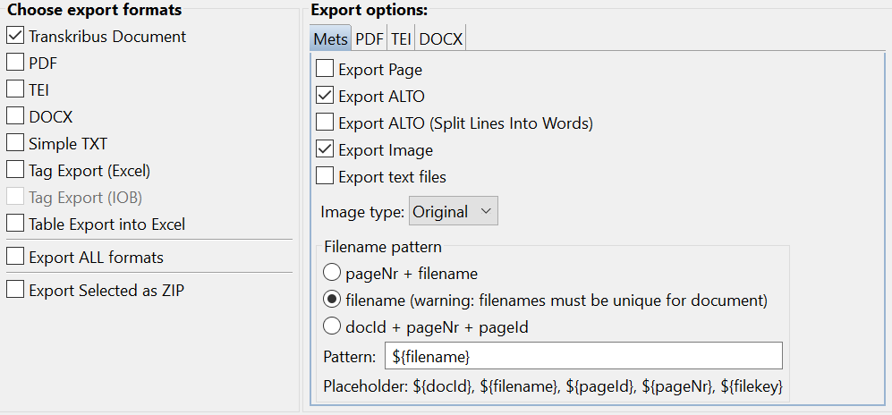

[](LICENSE) []()

# ASPYRE GT

A converter to help making your data compatible for import in eScriptorium. 
<!--A pipeline to transfer ground truth from [Transkribus](https://transkribus.eu/Transkribus/) to [eScriptorium](https://escriptorium.fr/).-->


## SUMMARY 
1. [How to use Aspyre](#how-to-use-aspyre)
2. [Configuring the export from Transkribus](#configuring-the-export-from-transkribus) 
3. [Reporting Errors](#reporting-errors) 
4. [Wiki](#wiki)


## How to use Aspyre
- [As a library](#as-a-library)
- [As a CLI](#as-a-cli)
- ~~[As a service online (GUI)](#as-a-service-online)~~


### As a library
Aspyre is a library. To install it, simply download `aspyrelib/` and make sure to install the dependencies! Use `from aspyrelib import aspyre` to import it in your program.


##### Parsing parameters with `aspyre.AspyreArgs()`
Start your project parsing all the required information with AspyreArgs() objects.

```python
Process essential information to run Aspyre
          :param scenario: keyword describing the scenario (string)
          :param source: path to source file (string)
    [opt] :param destination: path to output (string)
    [opt] :param talkative: activate a few print commands (bool)
    [opt] :param vpadding: value to add to VPOS attr. in String nodes (int)
```

> supported values for `scenario`: "tkb", "pdfalto", "limb"  

> `vpadding` is only used in PDFALTO and LIMB scenarios

##### Transkribus to eScriptorium scenario with `aspyre.TkbToEs()`
:warning: really not the best way to [transfer data between these two softwares](https://lectaurep.hypotheses.org/documentation/de-transkribus-a-escriptorium).

Run Transkribus to eScriptorium (mainly resolve schema declaration, source image information).

```python
Handle a Transkribus to eScriptorium transformation scenario
        :param args: essential information to run transformation scenario (AspyreArgs)
```

##### PDFALTO to eScriptorium scenario with `aspyre.PdfaltoToEs()`
Run PDFALTO to eScriptorium scenario (mainly resolve schema declaration, source image information and homothety)

```python
Handle a PDFALTO to eScriptorium transformation scenario
        :param args: essential information to run transformation scenario (AspyreArgs)
```


### As a CLI

A legacy script (`run.py`) from earlier stage enables you to use Aspyre as a CLI fairly easily.


#### Step by step (Transkribus scenario)
- Export the transcriptions and the images from Transkribus; you now have a zip file
<!--- ~~Unzip the file to a directory you will serve to Aspyre as the location of the sources~~ *(unnecessary with Aspyre 0.2.4!)*-->
- Create a virtual environment based on Python 3 and install dependencies (cf. *requirements.txt*)
- Run *aspyre/run.py* (`python3 aspyre/run.py`) with the fitting options
- See the CLI's options with *--help** (`python3 aspyre/run.py --help`)
- Aspyre will create a new ZIP that can be loaded onto eScriptorium

#### Example 

``` python
$ virtualenv venv -p python3
$ source venv/bin/activate
(venv)$ pip install -r requirements.txt 
(venv)$ python3 aspyre/run.py -i /path/to/exported/documents
```


### As a service online

> This is no longer an option, following Heroku's decision in 2021 to stop supporting free hosting services. 

You can now access Aspyre as a service online (GUI)! :arrow_right: [**`go to Aspyre GUI`**](https://aspyre-gui.herokuapp.com/)

#### Step by step (Transkribus scenario)

- Export the transcriptions and the images from Transkribus; you now have a zip file
- If your archive weighs more than 500 MB, remove the images from the zip file (unzip the archive and rezip it keeping only the alto/ directory and the 'mets.xml' file)
- Load the zip file onto the application and download the returned zip file
- You can now directly load this new ZIP onto eScriptorium

---

## Configuring the export from Transkribus
Export your data checking the “Transkribus Document” format option and checking the **“Export ALTO”** and **“Export Image”** sub-options.

> 


## Which input from PDFALTO?

Contenu minimum: 

```python
dossier(.zip)/
    - out/
        - identifiant.xml_data/
            - image-1.png
        - identifiant.xml
```

> Pour le moment les archives tar.gz ne sont pas supportées. Seules les archives zip le sont.

---

## Reporting Errors

If you notice unexpected errors or bugs or if you wish to add more complexity to the way Aspyre transforms the ALTO XML files, please [create an issue](https://github.com/alix-tz/aspyre-gt/issues/new) and contribute!

---

## Wiki
- [What was the problem?](https://github.com/alix-tz/aspyre-gt/wiki/What-was-the-problem%3F)
